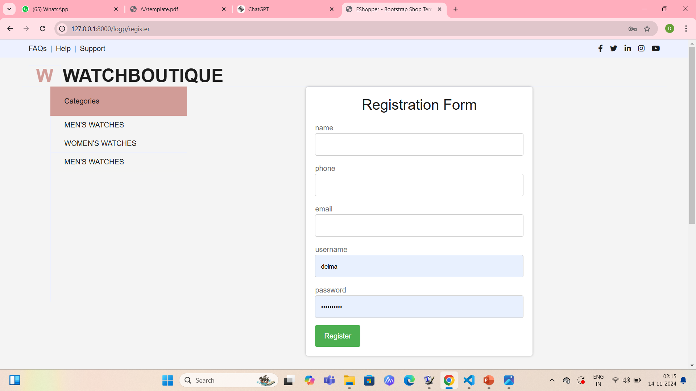
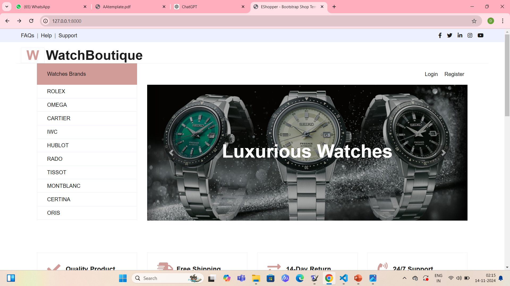
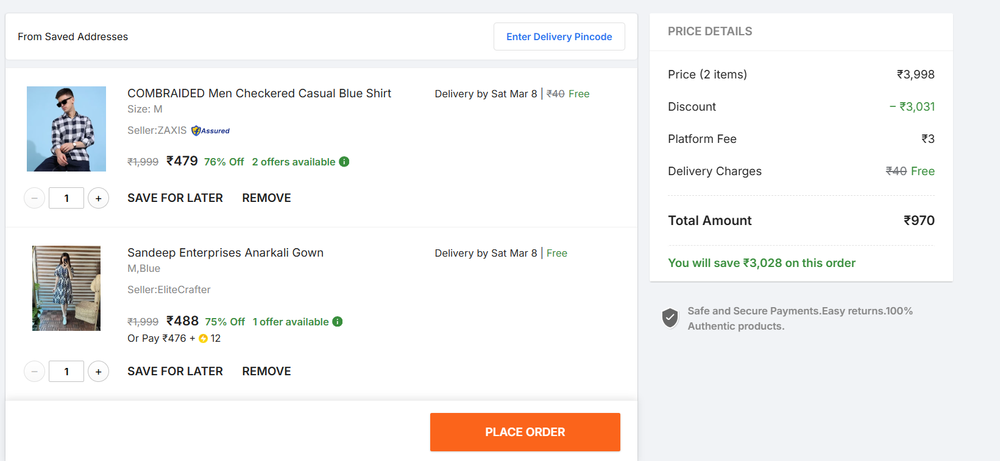
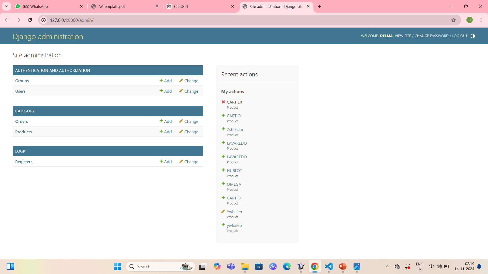
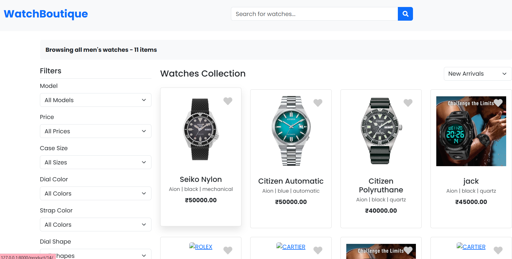
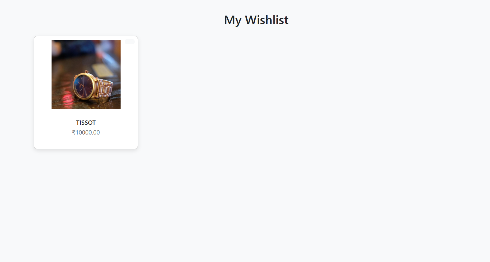
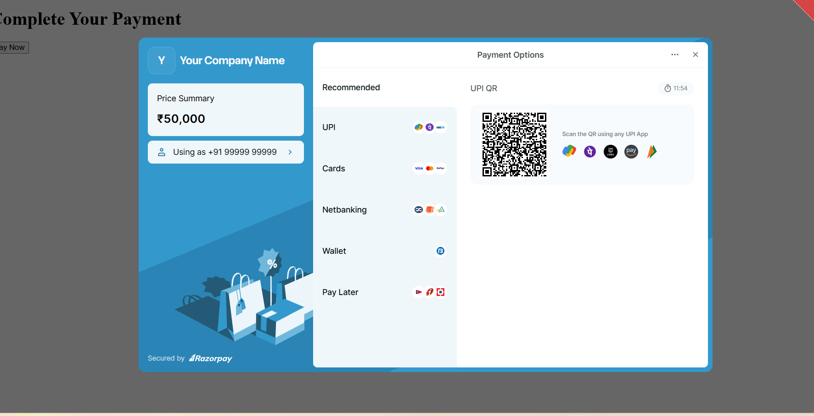

# WatchBoutique 🕒

**WatchBoutique** is an online store for stylish watches built using Python Django. It supports features like product browsing, user login, cart, wishlist, checkout, and order tracking.

## 🛠 Tech Stack

- Python (Django Framework)
- HTML, CSS, JavaScript
- SQLite3 (or any DB of your choice)
- Bootstrap (optional)

## 💡 Features

- 🧑‍💻 User Registration and Login
- 🛒 Add to Cart / Buy Now
- 📦 Order Tracking
- ❤️ Wishlist Functionality
- 🔐 Admin Panel for Product Management

## 🚀 How to Run

```bash
# Clone the repo
git clone https://github.com/delma2003/WatchBoutique.git

# Navigate to the project folder
cd WatchBoutique

# Activate virtual environment (if using)
source myenv/bin/activate  # or myenv\Scripts\activate on Windows

# Run migrations
python manage.py migrate

# Run the server
python manage.py runserver

## 🖼️ Screenshots

### 👤 Register Page


### 🏠 Index Page


### 🛒 Cart Page


### 🛠️  Admin Page


### 👔 Men's Page


### ❤️ Wishlist Page


### 💳 Payment Page



